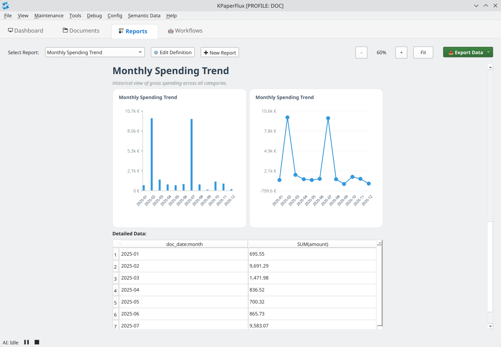
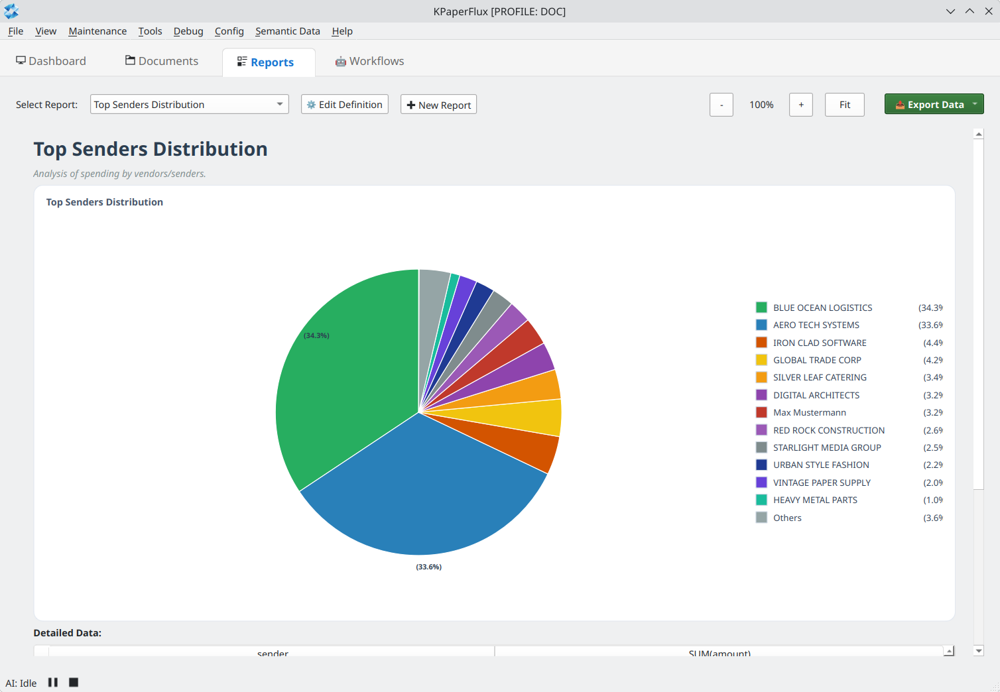

  
  <h1 align="center">KPaperFlux</h1>
  

    <strong>Semantic Document Intelligence & Forensic Analysis</strong> 
    <em>Bridging the gap between physical documents and structured digital twins.</em>
  

  

    
    
    
    
  

> [!WARNING]
> **PRE-RELEASE SOFTWARE:** KPaperFlux is currently in a state of rapid development. Breaking changes are common. **Use with real, sensitive data at your own risk!** Always keep backups of your documents.

---

## 🏛️ Project Philosophy

KPaperFlux is a **Document Refiner** designed for precision and technical sovereignty. While traditional systems focus on archival and search, KPaperFlux aims at **deep understanding**: converting visual and textual information into structured, mathematically validated data.

*   **Forensic Separation:** Specialized engines extract "noise" (stamps, signatures, handwriting) for separate analysis, ensuring the integrity of the core transactional data.
*   **Multi-Type-Tag Architecture:** Documents are managed using a polymorphic tagging system. For documents identified with a `Finance` tag, KPaperFlux enforces strict EN 16931 (ZUGFeRD) data management for high-fidelity accounting and analytics.
*   **Data Control & AI Choice:** Physical document storage and vault management are strictly local. Users can opt for high-performance semantic analysis via Google Gemini, accepting the trade-offs of cloud-based processing, or rely on local-only extraction for maximum privacy (foregoing advanced AI insights).
*   **Automated Validation:** Integrated logic engines perform cross-checks on financial totals and tax rates, prioritizing consistency and factual accuracy.

---

## 🖼️ Showcase: Intelligence in Action

   
  <em><strong>Visual Analytics:</strong> Seamlessly track financial trends with high-density charting and dynamic zooming.</em>

<table align="center">
  <tr>
    <td align="center"><b>Forensic Rules Engine</b> </td>
    <td align="center"><b>Smart Import Splitter</b> </td>
  </tr>
  <tr>
    <td align="center"><b>Hybrid PDF Matching</b> </td>
    <td align="center"><b>Vendor Distribution</b> </td>
  </tr>
</table>

---

---

## 🔥 Technical Highlights

### 🧠 Semantic Analysis Pipeline
*   **Multi-Stage Extraction:** Uses an adaptive pipeline (Stage 1 to 2) to classify documents and extract structured JSON compliant with **EN 16931 (ZUGFeRD 2.2)**.
*   **Visual Auditor (X-Ray):** Separates visual artifacts (accounting stamps, handwritten "Paid" notes, signatures) from the background text for independent analysis.
*   **Mathematical Integrity:** Automated cross-checking of net/tax/gross totals to ensure 100% calculation consistency.

### 📄 Professional PDF Rendering
*   **Re-Materialization:** Generates high-quality, DIN 5008 compliant PDF documents from semantic data.
*   **Advanced Layouting:** Dynamic column calculation for item lists, automatic pagination, and specialized support for certificates (RoHS, REACH) and legal statements.

### 🧩 Hybrid PDF & Forensic Trust
*   **Vector Protection:** Instead of "baking" scans into PDFs, KPaperFlux overlays transparent signatures on original vector documents, preserving 1:1 text quality and minimal file size.
*   **Chain of Trust:** Hybrid PDFs automatically embed the original digitally signed source document as an attachment for legal validity.

### 🤖 Agent-Based Workflows
*   **Playbooks:** Process documents through custom-defined state machines (e.g., `VERIFIED` → `TO_PAY` → `ARCHIVED`).
*   **Automation:** Intelligent routing based on AI-evaluated metadata.

### 📊 Advanced Reporting & Dynamic Dashboards
*   **Dynamic Analytics:** Real-time generation of charts (Bar, Pie, Line) based on your entire document corpus.
*   **Intelligent Visualization:** Pie charts with automatic "Others" grouping, side legends with elision, and pattern-based color distinction for maximum readability.
*   **Relative Date Filtering:** Predefined smart filters (Today, YTD, Last 90 Days) that stay dynamic as time passes.
*   **Global Zooming:** Visual consistency from 50% to 300% zoom across all report elements.

### 📦 Multi-Format Data Export
*   **Structured Data:** Export report results to CSV for external spreadsheet analysis.
*   **Document Archives:** One-click ZIP export of all original PDF source documents associated with a specific report.
*   **Hybrid PDF Reports:** (In Progress) Exporting visual reports as PDFs with embedded semantic metadata.

---

## 🏗️ Status & Development
*   **Current State:** Active development. High-stability core with rapidly evolving reporting and export capabilities.
*   **Reporting:** Feature-complete dynamic dashboard engine with multi-format export.
*   **GUI:** Solid desktop experience; optimized for high-density information displays.
*   **Standardization:** Strict adherence to European invoicing standards (EN 16931).

---

## 🚀 Installation & Quick Start

1.  **Clone:** `git clone https://github.com/schnebeck/KPaperFlux.git`
2.  **Env:** `python3 -m venv venv && source venv/bin/activate`
3.  **Install:** `pip install -r requirements.txt`
4.  **Hardware:** `sudo apt install sane-airscan` (Recommended for network scanners).
5.  **API Key:** Provide a Google Gemini API Key in `~/.config/kpaperflux/KPaperFlux.conf`.

---

## 🤝 Contribution & License

KPaperFlux follows strict **Clean Code** and **TDD** principles. Details can be found in the `devel/` folder.

**License:** GNU General Public License v3.0  
*(c) 2025-2026 Thorsten Schnebeck & The Antigravity Team*
