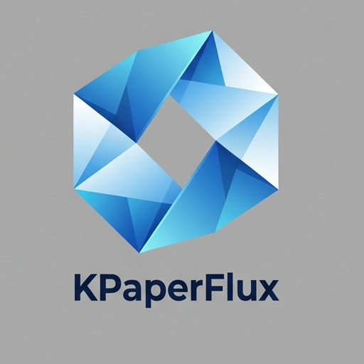

  
  <h1 align="center">KPaperFlux</h1>
  

    <strong>Document Management System with AI-Powered Semantic Analysis</strong> 
    <em>Implemented in Python/Qt6 using the Google Gemini API</em>
  

---

## Functional Overview

KPaperFlux is a tool for the capture, structuring, and archiving of documents. The focus lies on automated metadata extraction and the technical processing of PDF documents.

### 1. Analysis Pipeline
Processing occurs in several sequential stages:
*   **Classification (Stage 1):** Identification of document type and determination of logical boundaries (page ranges) for multi-document scans.
*   **Visual Analysis (Stage 1.5):** Detection and separate extraction of visual elements such as stamps, signatures, or handwritten notes.
*   **Semantic Extraction (Stage 2):** Transformation of text content into structured JSON data according to EN 16931 (ZUGFeRD 2.2). This includes sender and recipient data, financial metadata, and line item lists.
*   **Validation:** Mathematical verification of net, tax, and gross totals, as well as the normalization of banking data (IBAN/BIC).

### 2. PDF Processing and Rendering
*   **Hybrid PDF Architecture:** A method for the lossless merging of digital originals and analog additions. Signatures or stamps are overlaid as transparent layers on the vector document to maintain text quality and searchability.
*   **Automated PDF Generation:** Reconstruction of semantic data into DIN 5008 compliant PDF documents using ReportLab/Platypus.
    *   Dynamic column width calculation based on content length.
    *   Automated pagination with recurring headers and page counters.
    *   Support for financial documents and technical certificates (RoHS, REACH).

### 3. Workflow Control
*   **Playbook System:** Definition of processing states (e.g., `NEW`, `VERIFIED`, `PAID`) and transition rules.
*   **State Management:** Documents can follow different workflows based on extraction results or manual verification.

### 4. Integration and Formats
*   **ZUGFeRD / Factur-X:** Extraction of embedded XML metadata from PDF/A invoices.
*   **GiroCode:** Generation of EPC-QR codes from extracted payment data.
*   **Export:** CSV interface (Excel-optimized) for further processing in accounting systems.

---

## Technical Details

*   **Language:** Python 3.12+
*   **UI Framework:** PyQt6
*   **PDF Library:** PyMuPDF (fitz)
*   **Data Storage:** SQLite
*   **AI Interface:** Google GenAI (Gemini Flash/Pro models)

---

## Installation

### Prerequisites
*   **OS:** Linux
*   **Dependencies:** `sane-airscan` for network scanner support.
*   **API Access:** Google AI Studio API key for semantic analysis.

### Setup
1. Clone the repository.
2. Create a virtual environment (`python3 -m venv venv`).
3. Install dependencies (`pip install -r requirements.txt`).
4. Provide configuration in `~/.config/kpaperflux/KPaperFlux.conf`.

---

## License

This project is licensed under the **GNU General Public License v3.0**.
